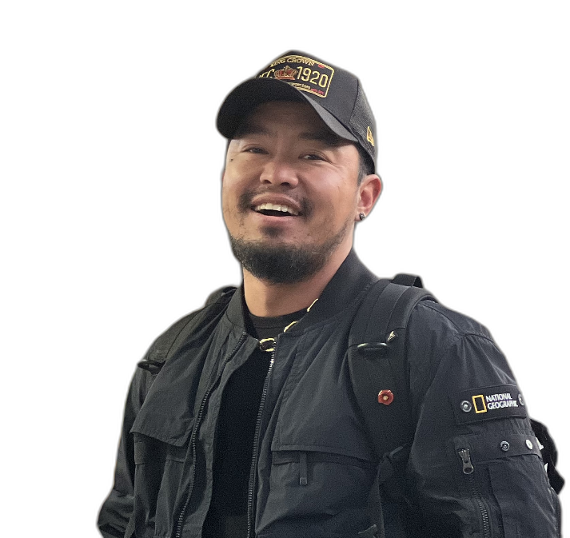

# Groc Edit

Groc Edit는 다수의 인물 사진에서 얼굴을 감지하고, 동일한 크기와 비율로 조정하여 머리부터 상반신까지 자동으로 크롭하는 프로그램입니다.

## 설치

1. 이 저장소를 클론합니다:

```sh
git clone https://github.com/monolith-taehyun/groc-edit.git
cd groc-edit
```

2. 가상 환경을 생성하고 활성화합니다:

```sh
python -m venv .venv
source .venv/bin/activate  # On Windows use `.venv\Scripts\activate`
```

3. 필요한 패키지를 설치합니다:

```sh
pip install -r requirements.txt
```

## 사용 방법

1. `input_images` 폴더에 처리할 이미지를 넣습니다.

2. 다음 명령어로 프로그램을 실행합니다:

```sh
python -m groc_edit.main
```

3. 처리된 이미지는 `output_images` 폴더에 저장됩니다.

## 처리 예시

**원본**


**Step 1. 리사이즈 & 크롭**


**Step 2. 배경 제거**



**Step 3. 프로필 배경 합성**


